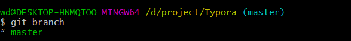
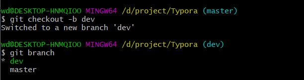
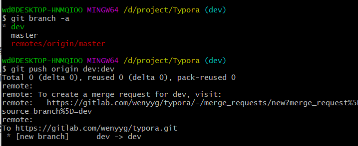
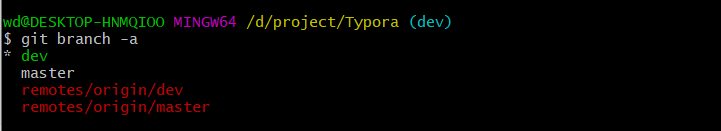
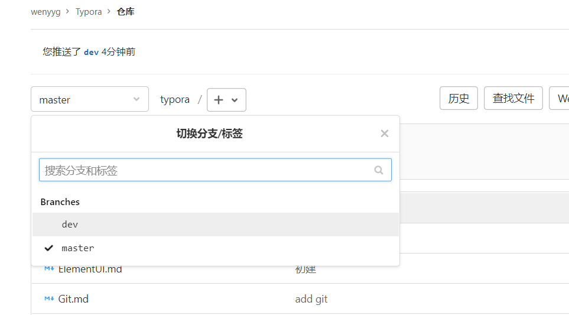
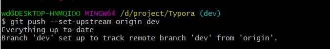
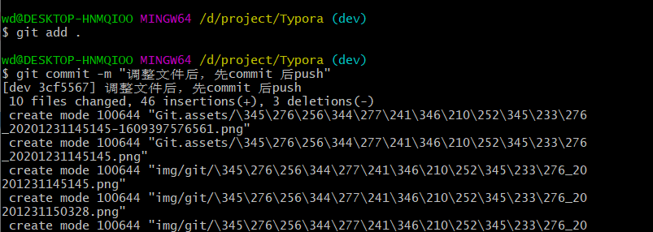
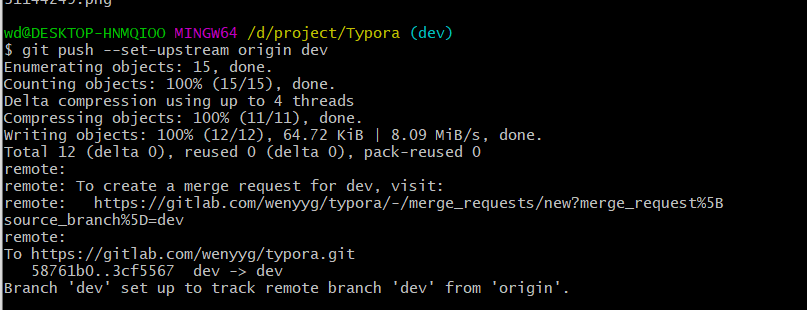
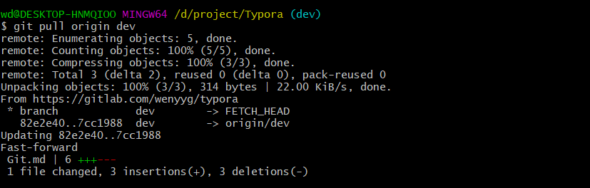
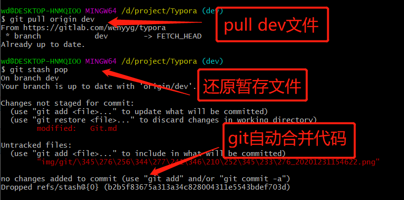

Git1

## 安装：

https://npm.taobao.org/mirrors/git-for-windows/

## 配置

右击打开Git Bash

> git init

配置用户名、邮箱

> git config --global  user.name "wyy"     //"wyy"是自己的账户名
>
> git config --global user.email "wenyyg@163.com"   //"wenyyg@163.com"注册账户时用的邮箱

生成ssh

> ssh-keygen -t rsa

## git操作

#### 创建本地分支并关联远程分支

##### 查看本地已有分支

> git branch

##### 创建本地分支

> git checkout -b 新分支名

执行该指令后，会在本地创建一个新分支，该分支是当前分支上检出的，所以所有文件内容都和当前分支一模一样，这是正常的。

创建成功后，将自动切换至新分支上。

##### 新建一个远程分支

> git push origin dev:dev        //创建一个远程分支 名字叫 dev

新建一个远程分支（同名字的远程分支）

> git branch -a                      

查看所有分支 ， 可以看到本地分支有：dev 、master；远程分支有dev、master

gitlab远程仓库上  也创建了一个dev分支

##### 将本地分支关联到远程分支

> git push --set-upstream origin dev

**ps**

创建远程分支dev，且内容都和当前分支一模一样，创建了新分支，依然push了origin master的版本；导致在关联远程分支时，提示everything up-to-date（所有最新）；

解决方法：在push之前必须要写commit

关联成功

##### 拉取远程分支到本地分支

> git pull origin dev

当远程分支的文件有修改时， 拉取远程分支到本地分支，文件会出现冲突

##### 解决冲突

> git stash                //先将本地修改存储起来

> git stash list         //用git stash list查看保存的信息

暂存了本地修改之后，就可以pull了

> git pull

还原暂存内容

> git stash pop

Git 自动合并代码--成功

本地分支代码

