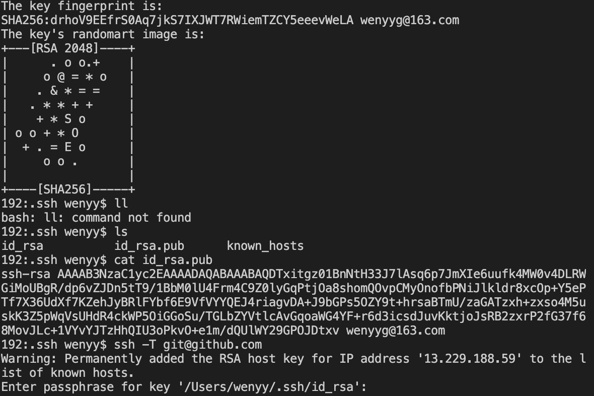

#### github链接不上

报错：fatal: unable to access "github库地址": LibreSSL SSL_connect: SSL_ERROR_SYSCALL in connection to github.com:443


#### 解决办法

##### 1.配置SSH

​	1）设置Git的user name和email

​			git config --list 查看当前Git环境所有配置

​			如果你是第一次使用，或者没有配置过的话需要操作一下命令（自行替换相应字段）

```
git config --global user.name "wenyyg"
git config --global user.email "wenyyg@163.com"
```

​	2）检查是否存在SSH Key

```
cd ~/.ssh
ls
或者
ll
```

​		看是否存在id_rsa和id_rsa.pub文件 ？

​		如果没有，则需要生成一下（自行替换相应字段）

```
ssh-keygen -t rsa -C "wenyyg@163.com"
```

​		再检查是否存在SSH Key

```
cd ~/.ssh
ls
或者
ll
```

​		如果存在，则获取SSH Key

```
cat id_rsa.pub
//拷贝秘钥 ssh-rsa开头
```

如下图




##### 2.GitHub添加SSH Key

​	GitHub点击用户头像，选择Settings，选择SSH and GPG keys

​	新建一个SSH Key 

​	取个名字，把之前拷贝的秘钥复制进去，添加就好啦


##### 3.验证

​	测试是否成功配置SSH Key

​	

```
ssh -T git@github.com
//运行结果出现类似如下
Warning: Permanently added the RSA host key for IP address '13.229.188.59' to the list of known hosts.
```

​	**将IP地址“13.229.188.59”的RSA主机密钥久添加到hosts文件里 （自行替换相应字段）**

​	**13.229.188.59  github.com**


##### 4.远程链接

​	删除，然后添加远程地址，提交代码（自行替换相应字段）

```
git remote rm origin
git remote add origin git@github.com:wenyyg/nodeData.git
git push -u origin master
```


**Ps: 生成SSH Key时，需要输入保存秘钥的文件以及密码，提交代码时需要再次输入此密码**